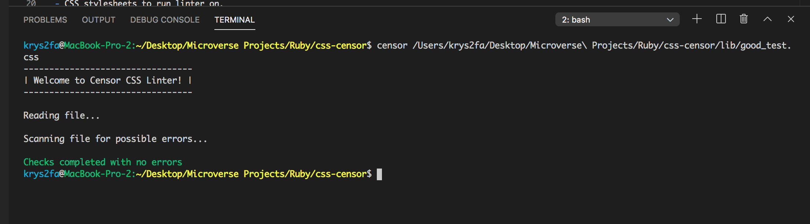

# css-censor
This is a CSS lint tool built as a Microverse Ruby capstone project.

## Built With
- Ruby
- Colorize gem
- RSpec
- GitFlow

## Description
This linter promotes best CSS practices by checking for:
  - Unwanted trailing spaces at the end of lines in a file.
  - Indentation of 2 spaces at the beginning of lines where necessary.
  - Empty line at the end of the file.
  - Spaces before opening curly braces.
  - Missing semi-colon at the end of lines where necessary.

## Live Demo
**Click [here](https://www.loom.com/share/6b13a2f8b35446bb957563af21bd3d4) in order to see a Live Demo of this project.**

## Screenshots
### Screenshot of linter passing with no errors
 

### Screenshot of linter displaying errors


## Getting Started

### Prerequisites
- Terminal/Command Prompt.
- CSS stylesheets to run linter on.

### Instructions
##### Setup
To get a local copy up and running follow these simple example steps.

- Download repository files.
- Open up a terminal session.
- In your terminal, change directory into the `css-censor/bin` folder.
- Run `ln -s $PWD/censor /usr/local/bin` in your terminal and then run `censor` + file to be checked. Eg: `censor main.css`.
- If the above does not work, just run `./censor` + file to be checked in your terminal. Eg: `./censor main.css`.

- Alternatively, you can quickly test this linter by running `censor lib/good_test.css` and/or `censor lib/bad_test.css`.
-  If you happen to be in the bin folder, run `./censor ../lib/good_test.css` and/or `./censor ../lib/bad_test.css`.

- If all else fails, `ruby bin/censor lib/good_test.css` will do the trick! 😉

## Good and Bad Code Examples
##### Good Code
```
.section {
  height: 2rem;
  width: 1rem;
}
```

##### Bad Code
```
.section{
    height: 2rem;
  width: 1rem;}
```

## Author

👤 **Christopher Amanor**

- Github: [@krys2fa](https://github.com/krys2fa)
- Twitter: [@krys2fa](https://twitter.com/krys2fa)
- Linkedin: [Christopher Amanor](https://www.linkedin.com/in/christopher-amanor/)


## 🤝 Contributing

Contributions, issues and feature requests are welcome!

Feel free to check the [issues page](issues/).

## Show your support

Give a ⭐️ if you like this project!

## 📝 License

This project is [MIT](lic.url) licensed.
